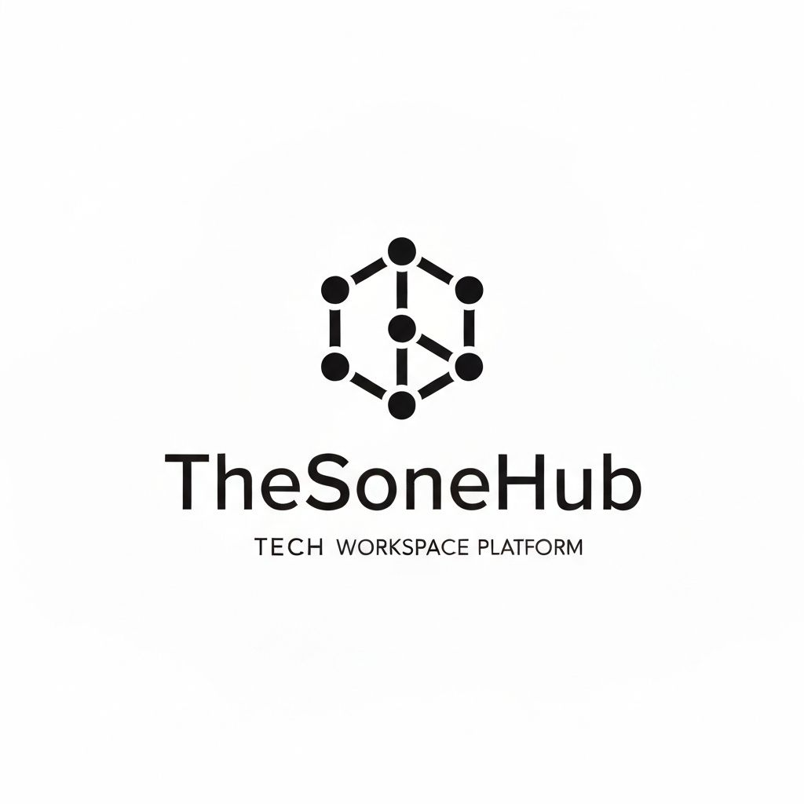

# TheSoneHub

**Your Personal Workspace Ecosystem**

TheSoneHub is a modern, Notion-inspired personal workspace platform designed for creators, builders, and learners. Built with Next.js 16 and featuring a clean black-and-white aesthetic, it serves as a central hub for projects, learning resources, digital notes, and community engagement.

## Features

### 🏠 Dynamic Homepage
- Interactive particle effects that follow cursor movement
- Floating card animations for smooth, engaging UI
- Quick access to all ecosystem sections
- Terminal Snake game for fun breaks

### 💼 Projects Showcase
- **TranBook v2.0** - Privacy-first in-app document translator with select-to-translate functionality
- **leaEng v4.2** - AI-powered English learning app with comprehensive skill development
- **ViralScript v1.0** - AI-Powered Script Editor for Short-Form Content
- Detailed project cards with logos, descriptions, and live demo links

### 📚 Learn Space
- Curated articles and tutorials
- Topics covering web development, AI, and automation
- Clean, readable article layout with metadata

### 🤖 AI Assistant
- Floating chat widget powered by OpenRouter API
- Multiple mentor modes (Tech, Creative, Business, Learning)
- Context-aware responses using DeepSeek R1 model

### 🌱 Digital Garden
- Personal knowledge base with note status tracking (Seedling, Growing, Evergreen)
- Tag-based organization
- Markdown support for rich content

### 👥 Community Forum
- Discussion threads and replies
- User engagement tracking
- Clean, organized conversation layout

### 👤 About/Portfolio
- Personal introduction and background
- Skills showcase (C++, Python, React, AI/ML)
- Project timeline and vision
- Social links and contact information

## Tech Stack

- **Framework**: Next.js 16 (App Router)
- **Language**: TypeScript
- **Styling**: Tailwind CSS v4
- **UI Components**: shadcn/ui
- **AI Integration**: OpenRouter API (DeepSeek R1)
- **Animations**: CSS animations, particle effects
- **Deployment**: Vercel

## Getting Started

### Prerequisites

- Node.js 18+ 
- npm or yarn
- OpenRouter API key (for AI chat functionality)

### Installation

1. Clone the repository:
\`\`\`bash
git clone https://github.com/TheSoneHub/the-sone-hub-site.git
cd the-sone-hub-site
\`\`\`

2. Install dependencies:
\`\`\`bash
npm install
\`\`\`

3. Set up environment variables:
\`\`\`bash
# Create .env.local file
OPENROUTER_API_KEY=your_openrouter_api_key_here
\`\`\`

4. Run the development server:
\`\`\`bash
npm run dev
\`\`\`

5. Open [http://localhost:3000](http://localhost:3000) in your browser

## Project Structure

\`\`\`
the-sone-hub-site/
├── app/
│   ├── about/              # Personal portfolio page
│   ├── agent/              # AI assistant page (legacy)
│   ├── api/
│   │   └── chat/           # AI chat API route
│   ├── community/          # Community forum
│   ├── garden/             # Digital garden
│   ├── learn/              # Learning resources
│   ├── projects/           # Projects showcase
│   ├── globals.css         # Global styles
│   ├── layout.tsx          # Root layout
│   └── page.tsx            # Homepage
├── components/
│   ├── ai-chat-widget.tsx  # Floating AI chat
│   ├── navigation.tsx      # Site navigation
│   ├── sphere-welcome.tsx  # Welcome screen with particles
│   ├── terminal-game.tsx   # Snake game
│   └── ui/                 # shadcn/ui components
├── public/
│   ├── thesonehub-logo.jpg # Site logo
│   ├── tranbook-logo.svg   # TranBook project logo
│   └── leaeng-logo.svg     # leaEng project logo
└── README.md
\`\`\`

## Environment Variables

| Variable | Description | Required |
|----------|-------------|----------|
| `OPENROUTER_API_KEY` | API key for OpenRouter AI service | Yes (for AI chat) |

## Design Philosophy

TheSoneHub follows a **Notion-inspired black and white aesthetic** with:
- Pure black backgrounds (#000000)
- White text and accents (#FFFFFF)
- Gray tones for secondary content
- Minimal, clean layouts
- Smooth animations and transitions
- Floating card effects for depth
- Interactive particle systems

## Key Features Implementation

### Particle System
The welcome screen features a custom particle system that:
- Follows cursor movement
- Connects nearby particles with lines
- Fades in smoothly on load
- Responds to user interaction

### AI Chat Widget
- Floating button in bottom-right corner
- Expandable chat interface
- Multiple mentor personalities
- Streaming responses
- Message history

### Floating Cards
All cards throughout the site feature:
- Gentle up-and-down floating animation
- Staggered animation delays
- Hover effects
- Smooth transitions

## Projects

### TranBook v2.0
**In-App Document Translator**
- Live Demo: [https://tranbook.netlify.app/](https://tranbook.netlify.app/)
- Features: Select-to-translate, local library, privacy-first
- Tech: HTML/CSS/JS, pdf.js, Google Gemini API

### leaEng v4.2
**Global Connect AI English App**
- Live Demo: [https://leaeng.netlify.app/](https://leaeng.netlify.app/)
- Features: Reading, writing, speaking, listening practice
- Tech: HTML/CSS/JS, Google Gemini AI

### ViralScript v1.0
**AI-Powered Script Editor for Short-Form Content**
- Live Demo: [https://viralscript.netlify.app/](https://viralscript.netlify.app/)
- Features: Smart editor workspace, AI creative coach, live analysis engine, hook bank
- Tech: HTML/CSS/JS, Google Gemini API, Marked.js
- Philosophy: "The Coach, Not The Crutch" - teaching viral content strategy
- Target: Myanmar short-form content creators (TikTok, Reels, YouTube Shorts)

## Author

**Pyae Sone Phyo (Sone)**
- Age: 20
- Location: Myanmar
- Role: Builder, Creator, Entrepreneur
- Focus: AI Automation, Web Development, Content Creation

### Connect
- GitHub: [@TheSoneHub](https://github.com/TheSoneHub)
- YouTube: [Sone Hub](https://youtube.com/@sonehub)
- Vision: Building AUTO company under Zonc Nexus brand

## License

This project is open source and available under the MIT License.

## Acknowledgments

- Built with [Next.js](https://nextjs.org/)
- UI components from [shadcn/ui](https://ui.shadcn.com/)
- AI powered by [OpenRouter](https://openrouter.ai/)
- Inspired by [Notion](https://notion.so/)'s clean design philosophy

---

**TheSoneHub** - Where creativity, connection, and inspiration converge.
